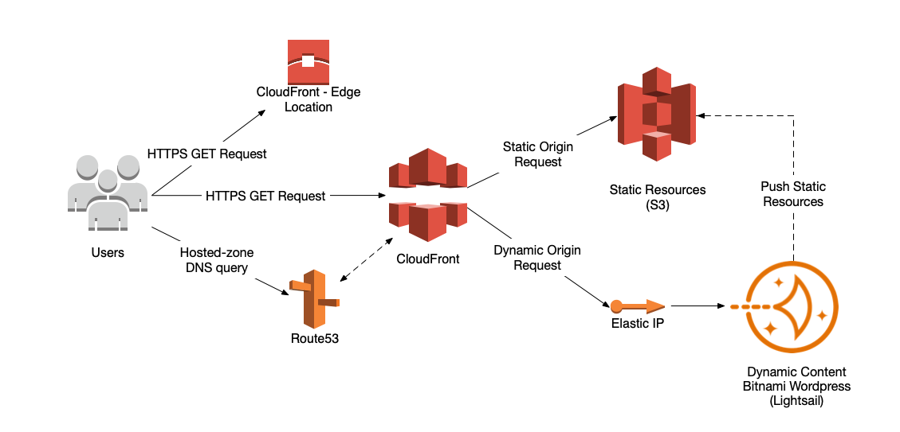

## Site building - a series of false starts...
### False start #1 - Medium
When I originally decided to create this new blog, I reviewed the options and decided to investigate [Medium](https://medium.com) as a social platform for content authoring and content curation. The benefits of Medium are that it allows an author to focus on content rather than the technical requirements of publishing content and hosting. One of the downsides is that you are ultimately handing control over to someone who is trying to monetize the plafform and content on it as part of their business. This led me to investigate an alternate model of hosting the master content elsewhere and cross-posting back to Medium.

### False start #2 - Wordpress.com
So, if Medium was going to be a secondary publishing platform, what should be used to host the master content? My next logical step was to revisit Wordpress, which I used briefly (over 10 years ago) for my [Objectfactory](https://objectfactory.wordpress.com "Objectfactory Blog") blog. I always liked Wordpress as a platform but I wanted to automatically cross-post to Medium and using the standard multi-tenant [Wordpress.com]("https://wordpress.com") platform didn't provide the flexibility to use non-standard plugins such as [Official Medium Plugin]("https://wordpress.org/plugins/medium/"). This resulted in considering other Wordpress hosting options before progressing down a self-hosted Wordpress route primarily for two reasons:
1. I'm a technologist and engineer and therefore like to understand how to build something for myself, and
2. I'm from Yorkshire and therefore fiscally conservative :wink: and figured I could do it cheaper than standard managed hosting

### False start #3 - Self-Hosted Wordpress
I decided to build and deploy my own Wordpress instance hosted on AWS public cloud-hosting. Rather than using one or more dedicated EC2 compute instances, I used a Bitnami Wordpress stack, which provides a pre-packaged image for Amazon Lightsail and is the quickest way of getting up and running using a single virtual private server on AWS. As is so often the case, getting up and running was the easy part.

This wasn't so much an MVP as just an MP - lacking the viable aspect. If I was going to self-host this Wordpress instance, it needed to be protected from unauthorised access which meant deploying a series of Wordpress plugins ranging from [JetPack](https://en-gb.wordpress.org/plugins/jetpack/) which provides anti-spam protection and site-monitoring amongst other things, to plugins such as [WPS Hide Login](https://en-gb.wordpress.org/plugins/wps-hide-login/) which obscure the login URL for Wordpress.

I needed to ensure the site was backed up, not just using AWS snapshots but also backing up content using [UpdraftPlus](https://en-gb.wordpress.org/plugins/updraftplus/) and offloading static content to a CDN using [WP Offload Media Lite](https://en-gb.wordpress.org/plugins/amazon-s3-and-cloudfront/) to minimize the load and data transfer from the Wordpress server. This had already gone way beyond 'M' in the MVP.

This was before I'd even got into the smorgasboard of Wordpress themes such as [Neve](https://themeisle.com/themes/neve/) and how to use block editors such as [Gutenberg](https://wordpress.org/gutenberg/) and page builders like [Elementor](https://elementor.com).

> **Note:** Somewhere along the above journey, I also found out that the Official Medium Wordpress plugin was no longer supported for cross-posting to Medium :confounded:

By the time I'd finished, I was fairly happy with the setup as deployed which resembled the below and used the following list of Amazon services:
- Route53 for DNS hosted-zone name resolution and Domain Name registration
- Certificate Management for SSL certificate management
- Lightsail for virtual private server compute with static Elastic IP address
- S3 for hosting of static resources
- CloudFront for Content Distribution (CDN) for both static and dynamic content
- Identity Access Manager (IAM) for CloudFront/S3 authorization

Around this point, I came to the realization that my task list looked like this:
- [x] Register TLD (robexley.com)
- [x] Build a self-hosted wordpress instance more cheaply than available managed hosting.
- [x] Learn about Wordpress
- [x] Extend my knowledge and experience of AWS and the services available
- [x] Publish site and make available externally
- [ ] Write content

and I'd spent more time than I'd have liked battling with Wordpress themes, css and customization.

Note: The above task list has been created purely for artistic license.

## ...and then restart
With the opportunity to take a step back and reflect on what I'd created, I came to the realization that what I'd actually missed was the opportunity to simplify and create something which met my needs and would require significantly less ongoing maintenance. I didn't need a dynamic site using a complex stack like Wordpress, I needed something simple, lightweight and one in which I could author content in markdown and manage within github.

Enter [Hugo](https://gohugo.io)

to be continued....
